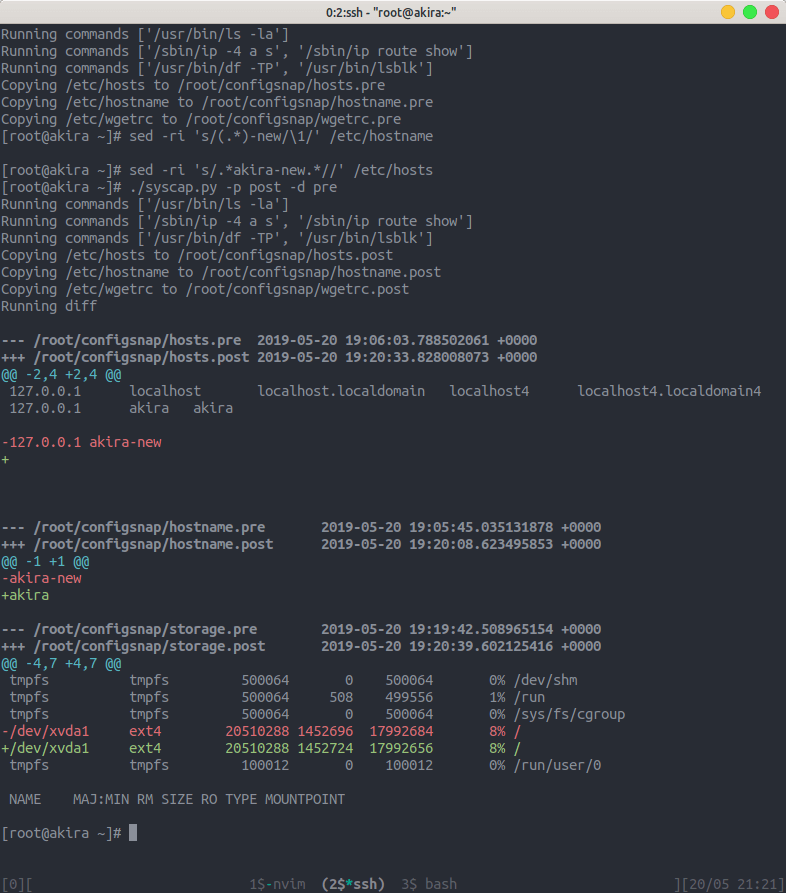

# Syscap

Syscap is a Python script for capturing Linux system state information into
tagged files, and subsequently performing a diff between two state tags.

## Installation

For the time being simply clone the repo down to your home directory and run
directly.

## Usage

```bash
./syscap.py -b /root -t configsnap -p pre
./syscap.py -b /root -t configsnap -p post -d pre
```

Hopefully after making some changes to your system files you should see
something similar to the following.



## Contributing
Pull requests are welcome; please also feel free to open an issue to discuss
larger changes.

## License
[MIT](https://choosealicense.com/licenses/mit/)
